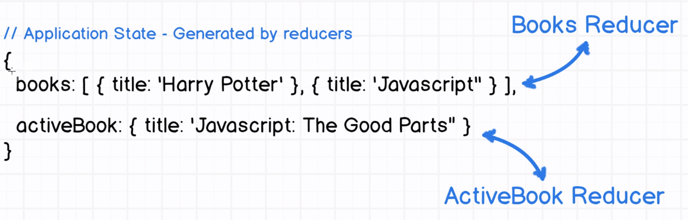
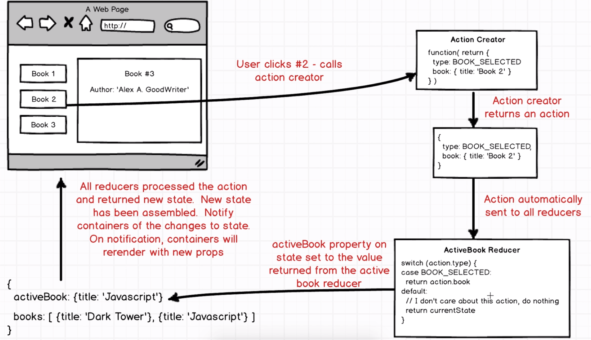

# ReduxBox

Getting hands dirty with [Redux](https://www.udemy.com/react-redux/). Please be kind and don't _laugh_

### What is a reducer?
Don't worry, me too I was wondering about it for a long time.
> So a **REDUCER** is a function that return a piece of the application state (value of the state)


### Okay, what about Redux itself?
Well according to their amazing website, this is what [**REDUX**](http://redux.js.org/) is all about:
> Redux is a predictable state container for JavaScript apps. (If you're looking for a WordPress framework, check out Redux Framework.)

> It helps you write applications that behave consistently, run in different environments (client, server, and native), and are easy to test. On top of that, it provides a great developer experience, such as live code editing combined with a time traveling debugger.




### How do one connect react and redux? Is it done out ot the box??
Well boy, sorry for you. At least for now, (unless I'm wrong), there is no such gift as out of the box react-redux.
However, there is some cool guys out there like you, well I mean like me.. ups like amazing people right... who create an amazing library called: [**react-redux**](https://github.com/reactjs/react-redux)

### Bottom line now?
Very simple, there is no intresinct relation between react and redux. Keep in mind that they are both separate.
It's like two cities separated by a big river. To travel from one to the other, you might need a bridge with is then the library named _**react-redux**_.

Oh yeah, there is also a angular version of redux called [**ng-redux**](https://github.com/angular-redux/ng-redux).

One more thing: React components are not smart. Do you know that? Well, I didn't say it but the *redux* guy said it. Because components in _redux_ are called
_**smart component**_. So react is just a bunch of  _**dump components**_ ? 

Well not really, because the team **react** pretty good and in a smart way to create what we have as a **container**.  

### Wait!! What is container? 
A container is a react component that has a direct connection to the state managed by redux.

### Where do you get all this informations from? 
:P Well 500 years ago, my ancerstor was named [Google](https://www.google.com) and ... Well let me keep the secret for now .. 

### You should check the big PICTURE .. Always!! 


### Getting Started

There are two methods for getting started with this repo.

#### Familiar with Git?
Checkout this repo, install dependencies, then start the gulp process with the following:

```
> git clone https://github.com/marcedem/reduxbox.git
> cd reduxbox
> npm install
> npm start
```
